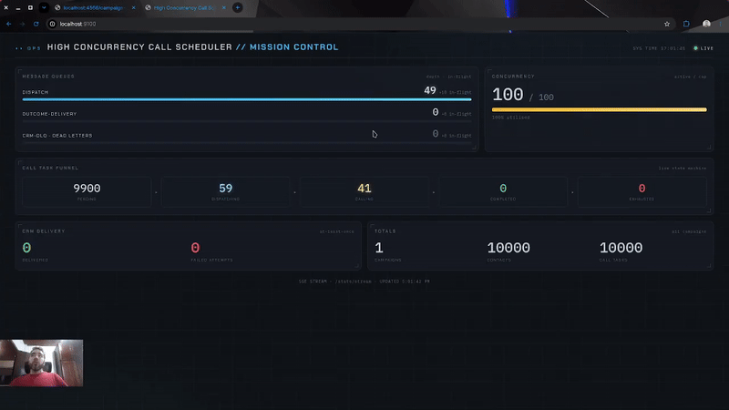
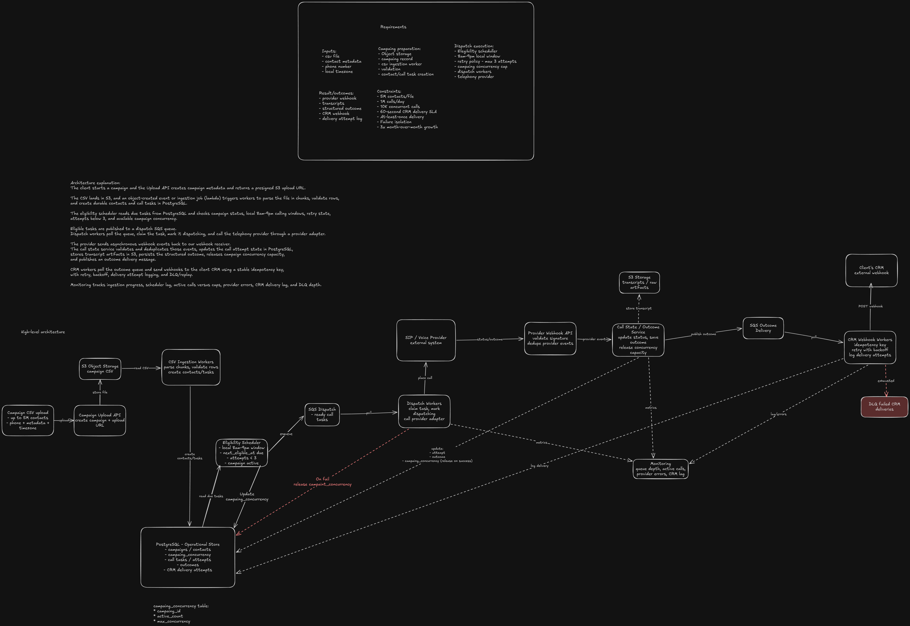

# High-Concurrency Call Scheduler

A local, end-to-end **high-concurrency call scheduller platform** — the
kind of system a Fortune 500 would use to turn a 5-million-row campaign upload into
millions of independently-scheduled voice-AI phone calls, place them through a
telephony provider, capture each outcome, and deliver it back to the client's CRM.

It runs entirely on your machine via **LocalStack** (S3, SQS, Lambda) + Docker
Compose. The goal is **architecture fidelity at small scale**: faithfully reproduce
the patterns and topology of a high-throughput distributed system — queue-decoupled
fan-out, failure isolation, idempotency, per-campaign concurrency caps, retry/backoff,
dead-letter queues, and a live operations dashboard — without pretending a laptop can
serve 10,000 concurrent calls.

## Watch it work



Three short videos, in the order they're meant to be watched — each one zooms in a
level deeper, from *seeing it run* to *understanding the design* to *reading the code*.

<table>
<tr>
<td width="33%" valign="top" align="center">

[](https://youtu.be/WWsjfVf3tQs)

**1 · [See it run](https://youtu.be/WWsjfVf3tQs)**

Boot the whole stack, upload a campaign, and watch the pipeline move on the live
dashboard — then break it with chaos mode and watch it recover.

</td>
<td width="33%" valign="top" align="center">

[](https://youtu.be/7a59g12OL3Q)

**2 · [Understand the design](https://youtu.be/7a59g12OL3Q)**

Follow one contact through the queue-decoupled fan-out pipeline and the guarantees
that keep it alive: concurrency caps, idempotency, retries, DLQs, the reaper.

</td>
<td width="33%" valign="top" align="center">

[](https://youtu.be/psnAk4uqomU)

**3 · [Read the code](https://youtu.be/psnAk4uqomU)**

Inside the concurrency-critical paths: `SKIP LOCKED` claiming, the atomic cap, the
stuck-task reaper, the state machine, and idempotent delivery.

</td>
</tr>
</table>

## Architecture



The spine is a **queue-decoupled fan-out pipeline**: a huge batch input is shattered
into tiny independent work items that flow through stages connected by durable
boundaries (SQS or Postgres) rather than direct calls. That decoupling is what buys
failure isolation, independent scaling, and backpressure.

```
Client → Campaign API → S3 (CSV)
                          │ (S3 ObjectCreated event)
                          ▼
                    Lambda: Ingestion ──► Postgres (contacts + call_tasks)
                                                │
                          Scheduler (worker) ◄──┘  claims eligible tasks (SKIP LOCKED),
                                │                   reserves concurrency, enqueues
                                ▼
                          SQS: dispatch ──► Dispatch workers ──► Telephony provider (mock)
                                                                      │ (signed async webhook)
                                                                      ▼
                          Outcome service ◄── Provider webhook (validate + dedupe)
                                │  transcript→S3, persist outcome, RELEASE concurrency
                                ▼
                          SQS: outcome-delivery ──► CRM workers ──► Client CRM (mock)
                                                          │ (idempotency key, retry/backoff)
                                                          ▼
                                                    SQS: crm-dlq (dead letters)

           Scheduler also runs a reaper: any task stuck in dispatching/calling past a
           timeout is reclaimed and its concurrency slot released — nothing blocks forever.

           Dashboard (SSE) projects live system health from Postgres + SQS.
```

### Components

| Service | Port | Role |
|---|---|---|
| `campaign-api` | 8000 | Create campaigns; hand out **presigned S3 upload URLs** (the API never touches the CSV bytes) |
| `ingestion` (Lambda) | — | S3 event → parse/validate CSV → durable `contacts` + `call_tasks` (idempotent) |
| `scheduler` (worker) | — | `SELECT … FOR UPDATE SKIP LOCKED` claiming, 8am–9pm local calling windows, atomic concurrency reservation, enqueue + stuck-task reaper |
| `dispatch-worker` | — | Consume `dispatch` SQS, place calls via a provider adapter |
| `mock-provider` | 9001 | Chaos-configurable telephony mock; fires signed async outcome webhooks |
| `outcome-service` | 9002 | Verify signature, dedupe, transcript→S3, persist outcome, **release concurrency**, publish |
| `mock-crm` | 9003 | Chaos-configurable client CRM; dedupes on idempotency key |
| `crm-worker` | — | Deliver outcomes to the CRM at-least-once with backoff; SQS dead-letters to `crm-dlq` |
| `dashboard` | 9100 | Live **mission-control** web page (SSE) |
| `postgres` | 5432 | Operational store (campaigns, contacts, call_tasks, outcomes, delivery log) |
| `localstack` | 4566 | Local AWS: S3, SQS, Lambda, IAM, Logs |

AWS resources (provisioned by **Terraform via `tflocal`**): S3 buckets
`campaign-uploads` / `call-artifacts`; SQS queues `dispatch` / `outcome-delivery` /
`crm-dlq` (redrive `maxReceiveCount=4`); the `ingestion` Lambda triggered by S3.

## What it demonstrates

Every non-functional requirement from the brief, observable live:

- **Failure isolation** — one bad call never blocks a campaign (a stuck-task reaper guarantees liveness).
- **At-least-once delivery** — made safe with stable idempotency keys; duplicate webhooks/deliveries are no-ops.
- **Per-campaign concurrency caps** — a race-free atomic counter; the cap "breathes" as calls complete and release slots.
- **Retry with backoff** — both for failed call outcomes (`plan_retry`) and CRM delivery (visibility-timeout backoff → DLQ).
- **Local calling windows** — calls only within 8am–9pm in each contact's own timezone.
- **Backpressure** — surplus work stays `pending`; the database is the backlog.

## Tech stack

Python 3.13 · FastAPI · SQLModel + Alembic · psycopg3 · boto3 · AWS Lambda ·
Terraform (`tflocal`) · PostgreSQL 18 · Docker Compose · LocalStack · `uv` · pytest.

## Prerequisites

- **Docker** + Docker Compose
- **[uv](https://docs.astral.sh/uv/)** (for tests / local tooling)
- A **free LocalStack auth token** — since v2026.03.0 LocalStack requires one even for
  the free Hobby tier. Get one at [app.localstack.cloud](https://app.localstack.cloud),
  then copy `.env.example` to `.env` and set `LOCALSTACK_AUTH_TOKEN`.

```bash
cp .env.example .env   # then paste your token
```

`.env` also holds the operational tuning knobs (calling-window hours, scheduler
batch size / poll interval, reaper timeout, dashboard refresh) — `SCHEDULER_`-prefixed
and read by `common.config.Settings`. They're injected into the containers via
docker-compose `env_file`, so to retune you edit `.env` and `make up` — no code change.

## Quick start

```bash
make up        # build + launch the entire stack (LocalStack, Postgres, infra, all services)
make demo      # create a campaign and upload the sample CSV straight to S3
```

Then open the **live dashboard**: <http://localhost:9100>

A reproducible **10,000-contact** CSV is included at `data/contacts-10k.csv`, plus a
small `data/sample-contacts.csv` spanning seven US timezones (so the calling-window
logic is visible).

## Make commands

Run `make` for the full, self-documenting list. Highlights:

| Group | Commands |
|---|---|
| **Lifecycle** | `up` · `down` · `clean` (wipe volumes) · `ps` · `logs` · `test` · `demo` |
| **Chaos** | `chaos-on` / `chaos-off` (crank/reset the mock failure rates) |
| **Terraform** | `tf-apply` · `tf-plan` · `tf-output` |
| **Database** | `db-migrate` · `db-revision m="…"` · `db-shell` |
| **Lambda** | `lambda-build` · `lambda-logs` |
| **Inspect** | `aws-info` (S3 buckets, SQS queues, DLQ redrive) |

## Resilience demo

The mocks expose a runtime chaos control plane (`POST /config`), so you can induce
failures and watch the system absorb them — with the dashboard's DLQ panel going red
the instant dead-letters appear.

```bash
make chaos-on                                      # ~30% provider + CRM failure, duplicates
# … watch the dashboard: retries, redeliveries, the DLQ filling, the cap still breathing …
make chaos-off

# Simulate vanished calls (lost webhooks) and watch the reaper reclaim them:
curl -s -X POST localhost:9001/config -H 'content-type: application/json' -d '{"drop_callback_rate":1.0}'
# calls reach 'calling' and stick → the scheduler's reaper reclaims them, freeing the cap
```

## Project layout

```
src/
  common/          shared config, db, aws/sqs helpers, models, signing, call_task state machine
  campaign_api/    FastAPI: create campaign + presigned upload
  ingestion/       Lambda handler: CSV → contacts + call_tasks
  scheduler/       claim_and_reserve (SKIP LOCKED + window + atomic cap) + reaper
  dispatch_worker/ SQS consumer + provider adapter
  outcome_service/ provider webhook + outcome processing
  crm_worker/      CRM delivery with idempotency + backoff + DLQ
  mock_provider/   chaos-configurable telephony mock (signed async callbacks)
  mock_crm/        chaos-configurable CRM mock (idempotency dedupe)
  dashboard/       read-only stats + SSE + mission-control page
infra/terraform/   S3 / SQS / Lambda as code (tflocal)
migrations/        Alembic migrations
data/              sample + 10k contact CSVs
docs/diagrams/     architecture diagram (Excalidraw + PNG)
```

## Testing

```bash
make test          # or: uv run pytest
```

Pure logic (parsing, the state machine, retry/backoff, signing) is unit-tested;
database and AWS behaviour is covered by integration tests that **skip gracefully** when
the stack isn't running (`make up` first to run them).

---

*This is a portfolio / learning project. The telephony provider and client CRM are
mocks; "calls" are simulated. It targets local fidelity of the architecture and its
failure modes, not production throughput.*
